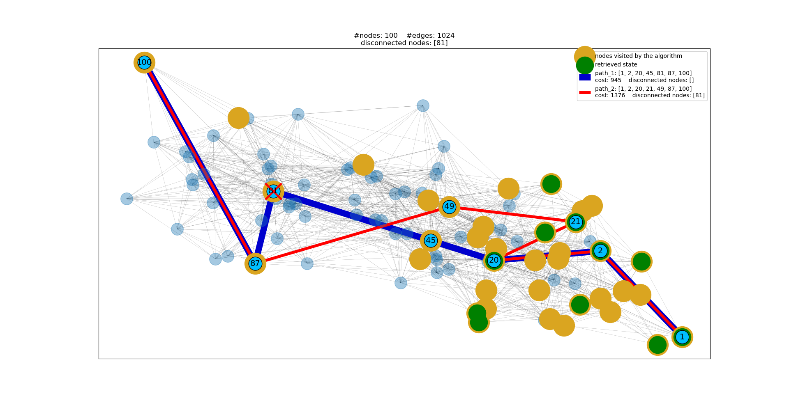

# PathPlanning

<br />

An adaptive version of Dijkstra's algorithm, using dynamic programming.



<br />

| requirements       |
| ------------------ |
| python3            |
| click>=7.1.2       |
| networkx>=2.5      |
| matplotlib>=3.3.2  |

<br />

## How to run it

1. anaconda environment

```bash
$ conda create --name pathp python=3
$ conda activate pathp
$ git clone https://github.com/ThanasisMattas/pathplanning.git
$ cd pathplanning
$ python setup.py install
$ pathplanning <num_nodes>
```

1. venv

```bash
$ git clone https://github.com/ThanasisMattas/pathplanning.git
$ cd pathplanning
$ python3 -m venv pathp
$ source pathp/bin/activate
$ python setup.py install
$ pathplanning <num_nodes>
```

## Brief overview

1. Random graph <br />
For the creation of random graphs, the [Erdős-Rényi] model is used. In a
nutshell, for a given number of nodes, all possible edges are generated and,
iterating over each edge, it is decided whether to keep it or not, using a
given probability. At the current implementation, the probability changes for
each edge, making it more possible to keep edges that connect nodes that are
near to each other. This way it is somewhat more realistic and paths that go
straight to the end are avoided. For the same reasons, weights of edges that
connect distant nodes are penalized.

2. Shortest path <br />
In order to find the shortest path, the [Dijkstra]'s algorithm is used. The
algorithm operates in a best-first search manner and, thus, a min-priority
queue is the optimum data structure. The corresponding build-in python module
is [heapq], where the priority queue is implemented with a heap, but it lacks
the ability to update the priority of an entry, which is required by the
algorithm. So, in order to add getting and setting support, the priorityq
module is implemented as a wrapper around the heapq module, as suggested [here].

3. Plot <br />
Lastly, networkx and matplotlib are used for the visualization.


## Options

**--weighted/--no-weighted** <br />
(defaults to True) <br />
**--weights-on** <br />
(options: "edges", "nodes", "edges-and-nodes"; defaults to "edges") <br />
**--max-edge-weight** <br />
(defaults to 1000) <br />
**--max-node-weight** <br />
(defaults to 1000) <br />
**--show-graph/--no-show-graph** <br />
(defaults to True)

<br />

> (C) 2020, Athanasios Mattas <br />
> atmattas@physics.auth.gr

[//]: # "links"


[Erdős-Rényi]: <https://en.wikipedia.org/wiki/Erd%C5%91s%E2%80%93R%C3%A9nyi_model>
[Dijkstra]: <https://en.wikipedia.org/wiki/Dijkstra%27s_algorithm>
[heapq]: <https://docs.python.org/3/library/heapq.html#module-heapq>
[here]: <https://docs.python.org/3/library/heapq.html#priority-queue-implementation-notes>