# ShortestPaths

![Conda] ![Build_Status] ![codecov]

<br />

Bidirectional replacement-paths and k-shortest paths search with dynamic
programming


<br />

| requirements       |
| ------------------ |
| python3            |
| click>=7.1.2       |
| networkx>=2.5      |
| numpy>=1.19.2      |
| matplotlib>=3.3.2  |

<!-- <br /> -->

## Overview

ShortestPaths constitutes thesis source code. It examines the optimization of
the bidirectional *replacement-paths* and *k-shortest paths* search, using
dynamic programming. The algorithm proposed memoizes the states of the search
of the parent path and retrieves them upon searching the consequent paths. The
optimization was validated experimentally in a parametric analysis of tree
parameters, the order, the density and the topology of the graph. The
replacement paths problem is solved on both *edge-exclusive* and
*node-exlusive* variations, as well as both *online* and *offline* versions.
Regarding the k-shortest paths problem, *k* online replacement-paths searches
are executed, following [*Yen*'s algorithm] with *Lawler*'s modification, while
utilizing the developed bidirectional search with dynamic programming.
[*Dijkstra*'s algorithm] is used for the shortest path search and a modified
*[Erdős-Rényi]* random graph model is introduced, controlling the density and
the topology of the graph. More specifically, the *small world* property is
captured by the topology of the graph, resulting in more realistic
representations.

The four supported methods for the k-shortest
paths search are:

1. Yen + Dijkstra
2. Lawler + Dijkstra
3. Lawler + Bid. Dijkstra
4. Lawler + Bid. Dijkstra + DP

A [PriorityQueue] class is implemented as a wrapper around [heapq], using the
<priority, entry_counter, entry> triple, as suggested [here].
<br />

Thesis supervisor: [Prof. Kostas Siozios]

## Install

```bash
$ conda install -c mattasa shortestpaths
```

```bash
$ pip install shortestpaths
```

## Usage

```bash
$ ksp [OPTIONS] COMMAND [OPTIONS]
```

```text
Options:
  -n INTEGER                      number of nodes (used when path is None)
                                  [default: 100]
  -k INTEGER                      number of shortest paths to be generated
                                  [default: 1]
  --weighted / --no-weighted      [default: True]
  --directed
  --weights-on [edges|nodes|edges-and-nodes]
                                  [default: edges-and-nodes]
  --max-edge-weight INTEGER       [default: 1000]
  --max-node-weight INTEGER       [default: 50]
  -y, --yen
  -l, --lawler
  -b, --bidirectional             use bidirectional shortest path search
  -p, --parallel                  use multiprocessing
  -d, --dynamic                   use dynamic programming
  -s, --seed INTEGER              fixes the random graph
  --layout-seed INTEGER           fixes the random initialization of the
                                  spring_layout.  [default: 1]
  --show-graph                    plots up to 8 paths
  --save-graph                    format: png
  -v, --verbose                   prints the generated paths

replacement-paths Options:
  -f, --failing [edges|nodes]  Setting what to fail, path edges or path nodes,
                               in order to produce the replacement paths.
                               [default: nodes]

  --online                     When online, the path up until the failure is
                               kept as it is (the algorithm is getting
                               informed upon meeting the failed node or edge),
                               whereas when not online, a new search starts
                               from the source, ignoring the parent-path (the
                               algorithm is a priori informed about the
                               failure).

```

### Load your graph

A [NetworkX formatted graph] can be loaded, using the following options:

```text
  --path TEXT                     The NetworkX-file path to read the graph
                                  from. If not provided, a random graph of n
                                  nodes will be generated. Supported formats:
                                  [.adjlist, .edgelist, .gexf, .gml, .gpickle]
                                  Note that .adjlist does not include weights.
  -s, --source TEXT               If a graph is not provided, the source
                                  defaults to node 1.
  -t, --target TEXT               If a graph is not provided, the target
                                  defaults to node n.
  --nodetype TEXT                 convert nodes to this type  [default: int]
  --comments TEXT                 marker for comment lines  [default: #]
  --delimiter TEXT                Separator for node labels. The default is
                                  whitespace.  [default:  ]
  --encoding TEXT                 [default: utf-8]
```

### Example format: .edgelist

```python
import networkx as nx
G = nx.Graph()
G.add_weighted_edges_from([[1, 2, 5], [1, 3, 6], [1, 4, 3], [2, 3, 1], [2, 4, 6]])
nx.write_weighted_edgelist(G, "testgraph.edgelist")
```

```testgraph.edgelist``` content:<br />
> 1 2 5<br />
> 1 3 6<br />
> 1 4 3<br />
> 2 3 1<br />
> 2 4 6<br />

## Examples

### Terminal

```text
$ ksp -v
$ ksp --show-graph -k 5 -n 100
$ ksp -v -d -k 20 -n 1000
$ ksp --seed 1 --show-graph -n 200 replacement-paths --failing edges
$ ksp --seed 1 --show-graph -n 200 replacement-paths --failing edges --online

$ ksp -v -d -s <source> -t <target> --path <path-to-graph> --directed -k 50
$ ksp -v -d -s <source> -t <target> --path <path-to-graph> replacement-paths
```

### Python

```python
import shortestpaths as sp

k_paths = sp.k_shortest_paths(G, s, t, k)
print("k_paths:")
sp.print_paths(k_paths)
sp.plot_paths(k_paths, G)

print()

mode = {"failing": "edges", "online": True}
r_paths = sp.replacement_paths(G, s, t, **mode)
print("r_paths:")
sp.print_paths(r_paths)
sp.plot_paths(r_paths, G, mode)
```

## Test

```bash
$ pytest --cov=shortestpaths shortestpaths
```

## Graph Model

### Goals

1. Control graph density
2. Control graph topology

### Nodal distance

Utilizing the incremental naming of the nodes, *distance* between two nodes is
represented by the difference of the node-IDs. For example, nodes 1 and 5 have
distance 4. Note that distance here has nothing to do with the corresponding
edge weight and does not affect the algorithm execution, rather it is only used
upon graph creation.

The frequency of pairs of nodes with distance *x*, in a simple, undirected,
complete graph (α), is given by the line:


Whereas, for the directed graph (β) the line is:


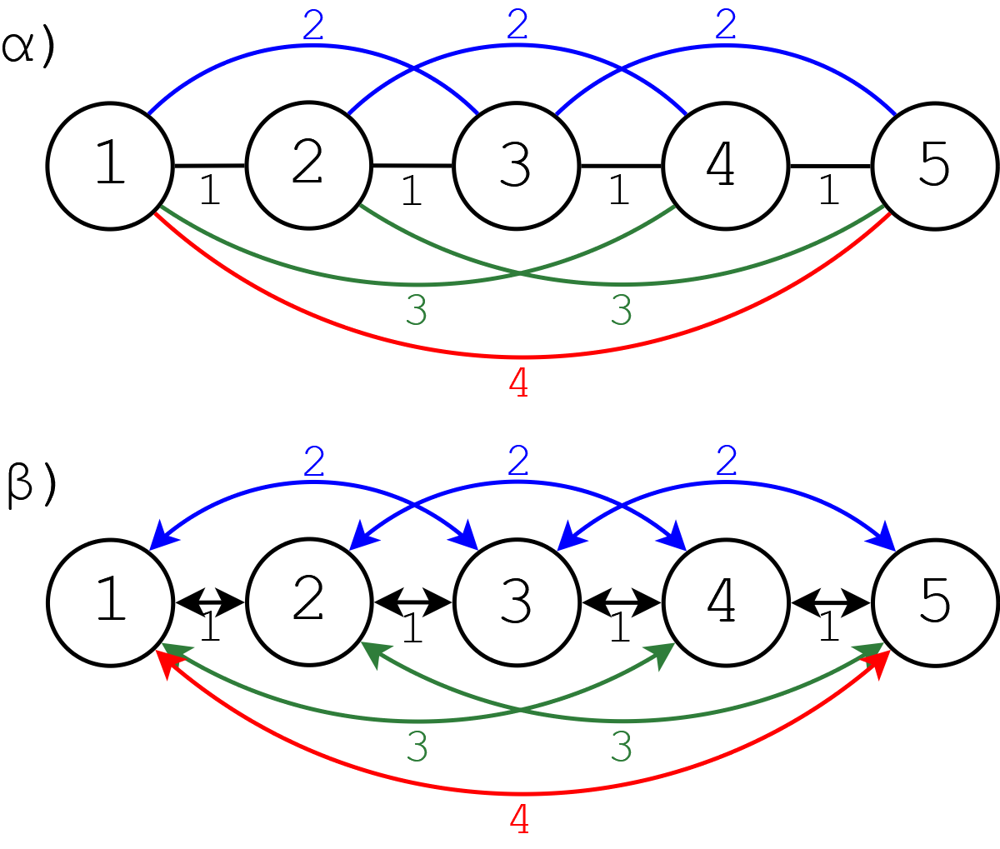

### Small world property

The model constitutes a variation of the Gilbert version of the *[Erdős-Rényi]*
model, where edge-probability is not uniform. More specifically, edges that
connect *distant* nodes are penalized, avoiding unrealistic paths that go to
the target with very few hops. This way, the *small world* property is
captured by the topology of the graph, meaning that nodes tend to form small
communities.

### Edge weights

The edge weigths are randomly selected from the range [0, MAX_EDGE_WEIGHT],
biased with respect to the distance of the adjacent nodes. Namely, edges that
connect distant nodes tend to get penalized.

### Probability distribution

In order to regulate the cutoff point of the edge-distances distribution, the
sigmoid equation is used, like a low-pass filter. To form the final probability
distribution equation, the sigmoid equation is subtracted from one, for the
smaller distances to have the greater probability. Fillaly, the result is
multiplied with an initial probability *p<sub>0</sub>*, controling further the
graph density.


### Expected nodal-distance distribution


### Expected graph density

<br />


### Model Summary

The proposed graph model uses 3 parameters:

* **c** : sigmoid center. Regulates the graph density, as well as defines the
cutoff point of the edge-distance distribution.
* **λ** : sigmoid gradient. Controls the area around the cutoff point.
* **p<sub>0</sub>** : initial probability. Regulates the graph density. It is
essentially the application of the Gilbert model over the graph formed by the
other two parameters.


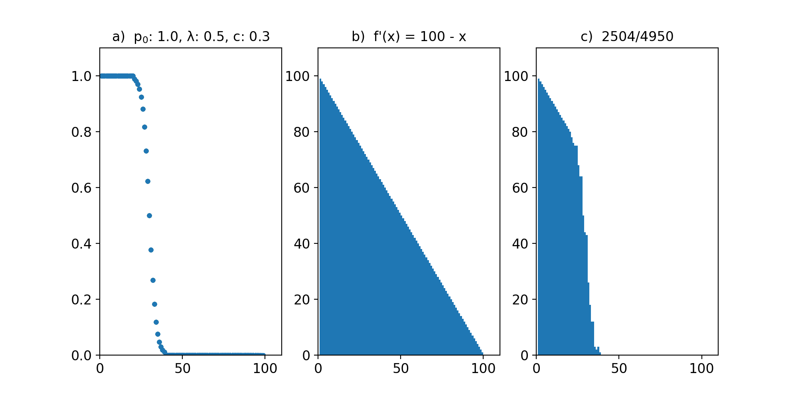<br />
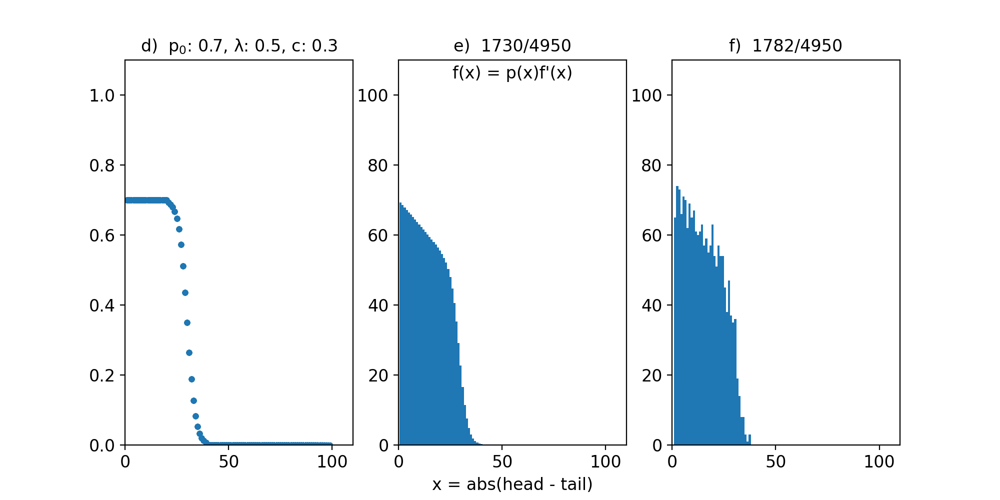

a. Nodal-distance probability distribution<br />
b. Nodal-distance distribution at the complete graph with n = 100<br />
c. Real nodal-distance distribution after applying the probability distribution
   of a. on the complete graph of b.<br />
d. Nodal-distance probability distribution with p<sub>0</sub> = 0.7 .<br />
e. Expected nodal-distance distribution after applying d. to b.<br />
f. Instantiation of e. A controlled randomness around the wanted topology is
   evident.<br />

### Usage

```python
import shortestpaths as sp

# adj_list format: [{(neighbor, hop_weight),},]
# G: nx.Graph or nx.DiGraph
adj_list, G = sp.random_graph(n,
                              weighted=True,
                              directed=True,
                              weights_on="edges",
                              max_edge_weight=100,
                              random_seed=None,
                              center_portion=0.2,
                              gradient=0.5,
                              p_0=0.7)

# inverted graph for reverse search
adj_list_reverse = sp.adj_list_reversed(adj_list)
```

## Applying Dynamic Programming

Regarding the **offline** replacement-paths, the algorithm conducts 2 searches of
the base path. The first is a simple path search. The second is the
*memoization* process, where, having knowledge of the path and, thus, knowing
which nodes/edges will fail, the algorithm memoizes only the states that
correspond to each path-node. More specifically, each direction of the
bidirectional search memoizes the described states, up until the *meeting edge*
of the search. For replacement paths that correspond to a failed edge/ node
that the forward search of the base path visited, the forward search retrieves
its state just before the failed item and the reverse search retrieves the last
recorded state, which is the state before the meeting edge. Likewise, the
opposite goes for items failing after the meeting edge.

At the **online** counterpart, the state of forward search cannot be memoized,
because the starting node is changing with each replacement-path. Therefore,
dynamic programming is used only at the reverse sub-search. Also, this time
there is no need for saving the states. As for the second of the 2 searches, a
unidirectional search starts from the target node, going backwards, and anytime
it is about to visit a path-node, the corresponding bidirectional
replacement-path search begins, using the current state as the reverse state.

Finally, the **k-shortest paths** search consists in executing *k* online
replacement-paths searches, following *Yen's* method with *Lawler's*
modification, where, obviously, the aforementioned first search is not
executed, because the parent path is already known.

### State retrieval | Replacement-paths offline

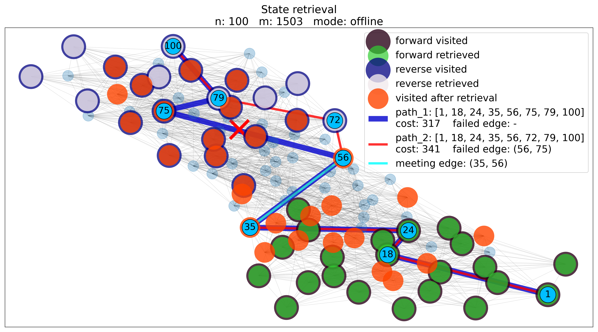 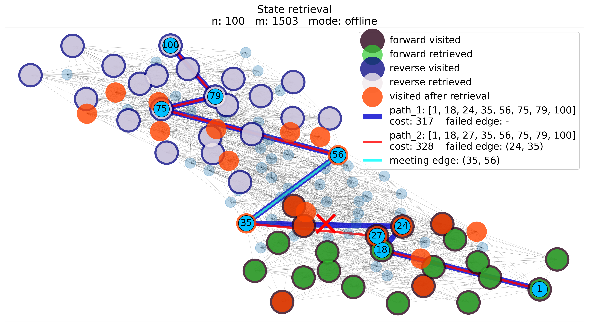

### State retrieval | Replacement-paths online

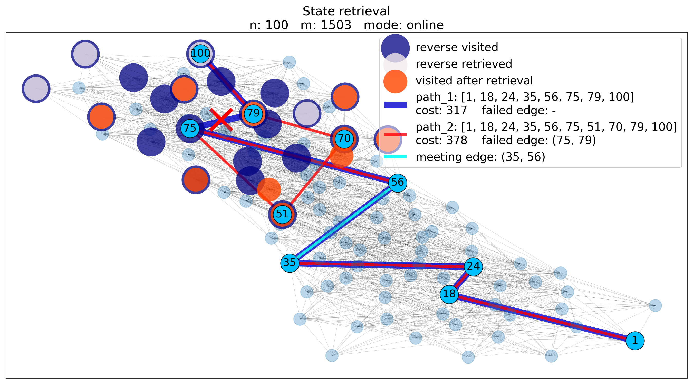 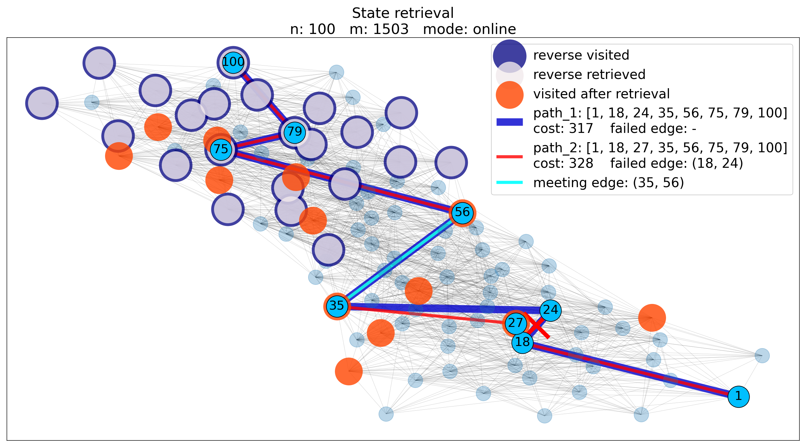

## Profiling

### CPU time vs n vs density

k: 10 &ensp;c: 0.15 &ensp;p<sub>max</sub>: 0.28

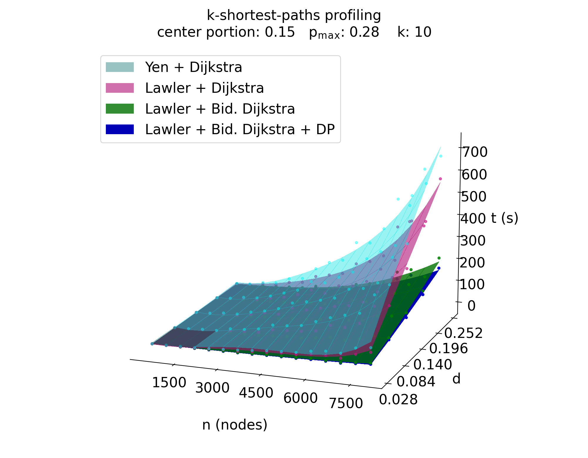

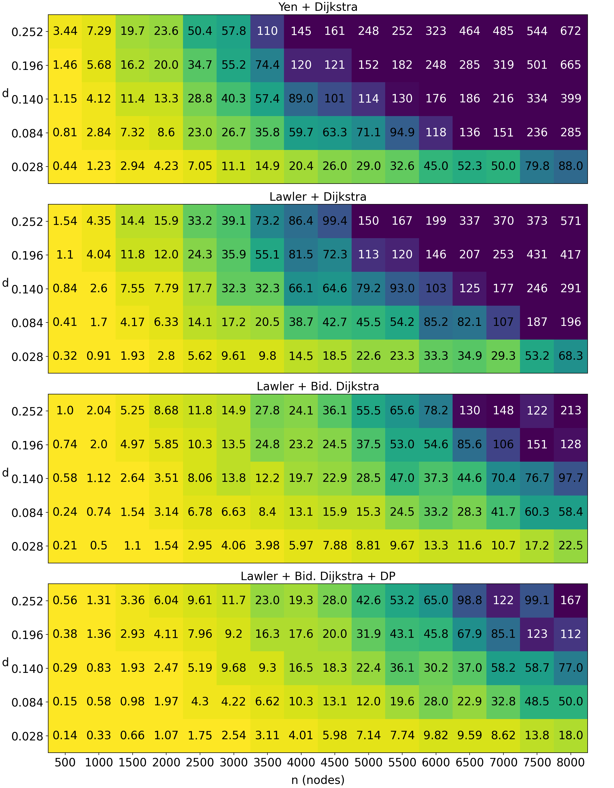

### CPU time vs n vs k

c: 0.15 &ensp;p<sub>0</sub>: 0.3 &ensp;p<sub>max</sub>: 0.28

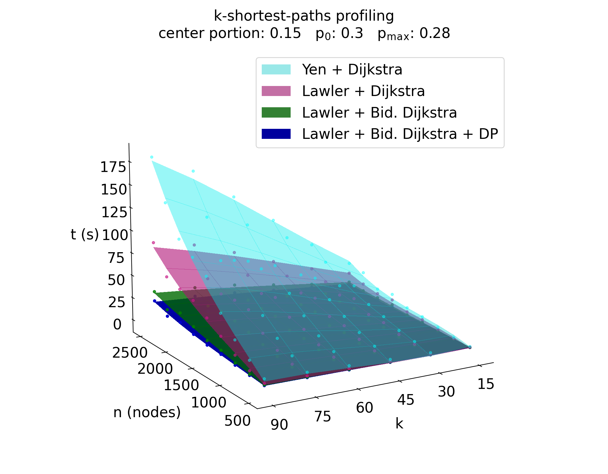

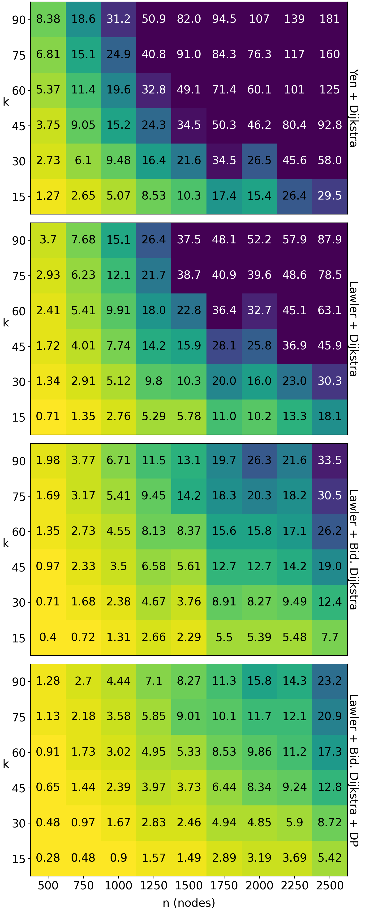


## Conclusion

* **DP** induces an optimization of the order **1-46%** over the bidirectional
  k-shortest paths search with *Yen*'s method and *Lawler*'s modification, at
  the scenarios tested.
* Graph **density** and graph **topology** play a significant role over the
  performance of algorithms and can effectively complement graph order for a
  more comprehensive study.

## License

[GNU General Public License v3.0]

<br />

> (C) 2020, Athanasios Mattas <br />
> atmattas@physics.auth.gr

[//]: # "links"

[Conda]: <https://img.shields.io/conda/v/mattasa/shortestpaths?color=blue>
[Build_Status]: <https://travis-ci.com/ThanasisMattas/shortestpaths.svg?branch=master>
[codecov]: <https://codecov.io/gh/ThanasisMattas/shortestpaths/branch/master/graph/badge.svg>
[Prof. Kostas Siozios]: <https://ksiop.webpages.auth.gr/>
[*Yen*'s algorithm]: <https://en.wikipedia.org/wiki/Yen%27s_algorithm>
[Erdős-Rényi]: <https://en.wikipedia.org/wiki/Erd%C5%91s%E2%80%93R%C3%A9nyi_model>
[*Dijkstra*'s algorithm]: <https://en.wikipedia.org/wiki/Dijkstra%27s_algorithm>
[PriorityQueue]: <https://github.com/ThanasisMattas/shortestpaths/blob/master/shortestpaths/priorityq.py#L20>
[heapq]: <https://docs.python.org/3/library/heapq.html#module-heapq>
[here]: <https://docs.python.org/3/library/heapq.html#priority-queue-implementation-notes>
[NetworkX formatted graph]: <https://networkx.org/documentation/stable/reference/readwrite/index.html>
[GNU General Public License v3.0]: <https://github.com/ThanasisMattas/shortestpaths/blob/master/COPYING>
