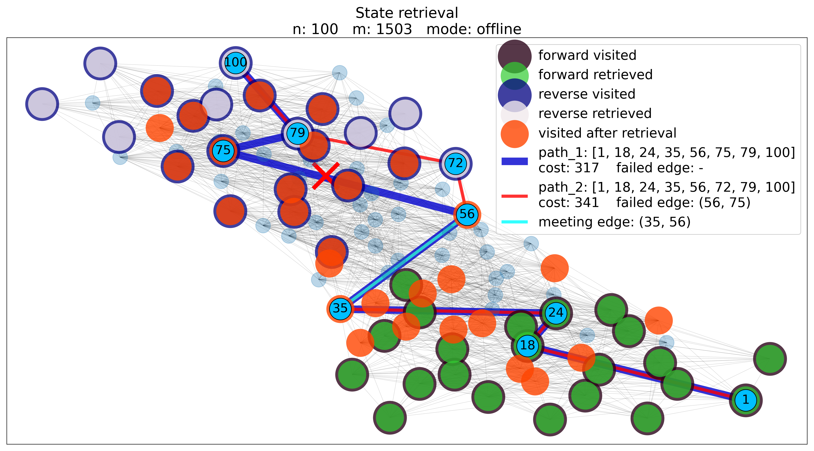
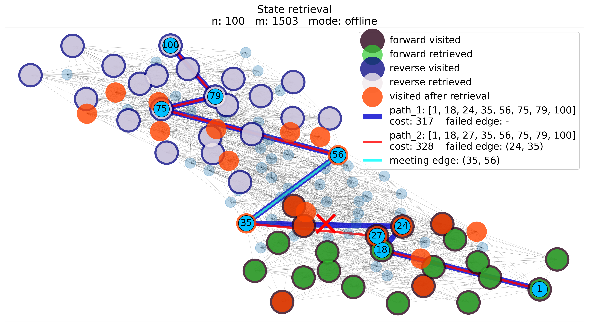
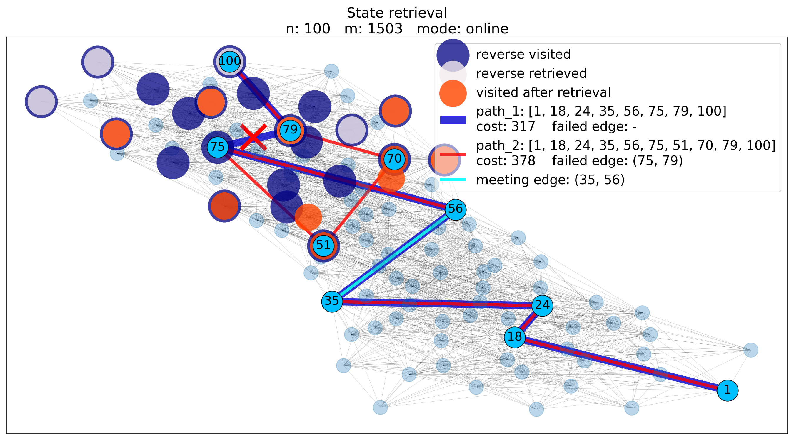
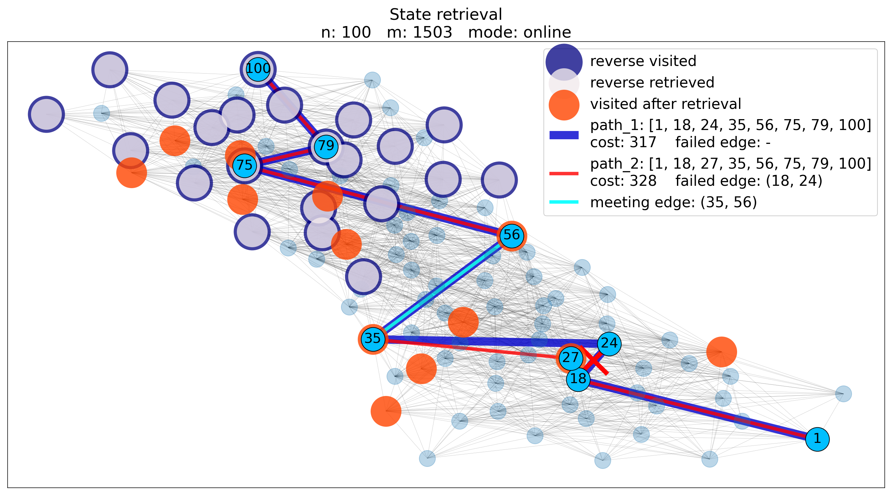

# ShortestPaths

![Conda] ![Build_Status] ![codecov]

<br />

Bidirectional replacement-paths and k-shortest paths search with dynamic
programming


<br />

| requirements       |
| ------------------ |
| python3            |
| click>=7.1.2       |
| networkx>=2.5      |
| numpy>=1.19.2      |
| matplotlib>=3.3.2  |

<!-- <br /> -->

## Overview

ShortestPaths constitutes thesis source code. It examines the optimization of
the bidirectional *replacement-paths* and *k-shortest paths* search, using
dynamic programming. The algorithm proposed memoizes the states of the search
of the parent path and retrieves them upon searching the consequent paths. The
optimization was validated experimentally in a parametric analysis of tree
parameters, the order, the density and the topology of the graph. The
replacement paths problem is solved on both *edge-exclusive* and
*node-exlusive* variations, as well as both *online* and *offline* versions.
Regarding the k-shortest paths problem, *k* online replacement-paths searches
are executed, following [*Yen*'s algorithm] with *Lawler*'s modification, while
utilizing the developed bidirectional search with dynamic programming.
[*Dijkstra*'s algorithm] is used for the shortest path search and a modified
*[Erdős-Rényi]* random graph model is introduced, controlling the density and
the topology of the graph. More specifically, the *small world* property is
captured by the topology of the graph, resulting in more realistic
representations.

The four supported methods for the k-shortest
paths search are:

1. Yen + Dijkstra
2. Lawler + Dijkstra
3. Lawler + Bid. Dijkstra
4. Lawler + Bid. Dijkstra + DP

A [PriorityQueue] class is implemented as a wrapper around [heapq], using the
<priority, entry_counter, entry> triple, as suggested [here].
<br />

Thesis supervisor: [Prof. Kostas Siozios]

## Install

```bash
$ conda install -c mattasa shortestpaths
```

```bash
$ pip install shortestpaths
```

## Usage

```bash
$ ksp [OPTIONS] N COMMAND [OPTIONS]
```

```text
Options:
  -n INTEGER                      number of nodes (used when path is None)
                                  [default: 100]
  -k INTEGER                      number of shortest paths to be generated
                                  [default: 1]
  --weighted / --no-weighted      [default: True]
  --directed
  --weights-on [edges|nodes|edges-and-nodes]
                                  [default: edges-and-nodes]
  --max-edge-weight INTEGER       [default: 1000]
  --max-node-weight INTEGER       [default: 50]
  -y, --yen
  -l, --lawler
  -b, --bidirectional             use bidirectional shortest path search
  -p, --parallel                  use multiprocessing
  -d, --dynamic                   use dynamic programming
  -s, --seed INTEGER              fixes the random graph
  --layout-seed INTEGER           fixes the random initialization of the
                                  spring_layout.  [default: 1]
  --show-graph                    plots up to 8 paths
  --save-graph                    format: png
  -v, --verbose                   prints the generated paths

replacement-paths Options:
  -f, --failing [edges|nodes]  Setting what to fail, path edges or path nodes,
                               in order to produce the replacement paths.
                               [default: nodes]

  --online                     When online, the path up until the failure is
                               kept as it is (the algorithm is getting
                               informed upon meeting the failed node or edge),
                               whereas when not online, a new search starts
                               from the source, ignoring the parent-path (the
                               algorithm is a priori informed about the
                               failure).

```

### Load your graph

A [NetworkX formated graph] can be loaded, using the following options:

```text
  --path TEXT                     The NetworkX-file path to read the graph
                                  from. If not provided, a random graph of n
                                  nodes will be generated. Supported formats:
                                  [.adjlist, .edgelist, .gexf, .gml, .gpickle]
                                  Note that .adjlist does not include weights.

  --nodetype TEXT                 convert nodes to this type  [default: int]
  --comments TEXT                 marker for comment lines  [default: #]
  --delimiter TEXT                Separator for node labels. The default is
                                  whitespace.  [default:  ]

  --encoding TEXT                 [default: utf-8]
  -s, --source TEXT               If a graph is not provided, the source
                                  defaults to node 1.

  -t, --target TEXT               If a graph is not provided, the target
                                  defaults to node n.
```

### .edgelist

```python
import networkx as nx
G = nx.Graph()
G.add_weighted_edges_from([[1, 2, 5], [1, 3, 6], [1, 4, 3], [2, 3, 1], [2, 4, 6]])
nx.write_weighted_edgelist(G, "testgraph.edgelist")
```

format:

#&#8203; tail head weight <br />
1 2 5<br />
1 3 6<br />
1 4 3<br />
2 3 1<br />
2 4 6<br />

## Examples

```text
$ ksp -v
$ ksp --show-graph -k 5 -n 100
$ ksp -v -d -k 20 -n 1000
$ ksp --seed 1 --show-graph -n 200 replacement-paths --failing edges
$ ksp --seed 1 --show-graph -n 200 replacement-paths --failing edges --online

$ ksp -v -s <source> -t <target> --path <path-to-graph> --directed -k 50
$ ksp -v -s <source> -t <target> --path <path-to-graph> replacement-paths
```

## Test

```bash
$ pytest --cov=shortestpaths shortestpaths
```

## State retrieval

### Replacement-paths offline

 

### Replacement-paths online

 

## License

[GNU General Public License v3.0]

<br />

> (C) 2020, Athanasios Mattas <br />
> atmattas@physics.auth.gr

[//]: # "links"

[Conda]: <https://img.shields.io/conda/v/mattasa/shortestpaths?color=blue>
[Build_Status]: <https://travis-ci.com/ThanasisMattas/shortestpaths.svg?branch=master>
[codecov]: <https://codecov.io/gh/ThanasisMattas/shortestpaths/branch/master/graph/badge.svg>
[Prof. Kostas Siozios]: <https://ksiop.webpages.auth.gr/>
[*Yen*'s algorithm]: <https://en.wikipedia.org/wiki/Yen%27s_algorithm>
[Erdős-Rényi]: <https://en.wikipedia.org/wiki/Erd%C5%91s%E2%80%93R%C3%A9nyi_model>
[*Dijkstra*'s algorithm]: <https://en.wikipedia.org/wiki/Dijkstra%27s_algorithm>
[PriorityQueue]: <https://github.com/ThanasisMattas/shortestpaths/blob/master/shortestpaths/priorityq.py#L20>
[heapq]: <https://docs.python.org/3/library/heapq.html#module-heapq>
[here]: <https://docs.python.org/3/library/heapq.html#priority-queue-implementation-notes>
[NetworkX formated graph]: <https://networkx.org/documentation/stable/reference/readwrite/index.html>
[GNU General Public License v3.0]: <https://github.com/ThanasisMattas/shortestpaths/blob/master/COPYING>
